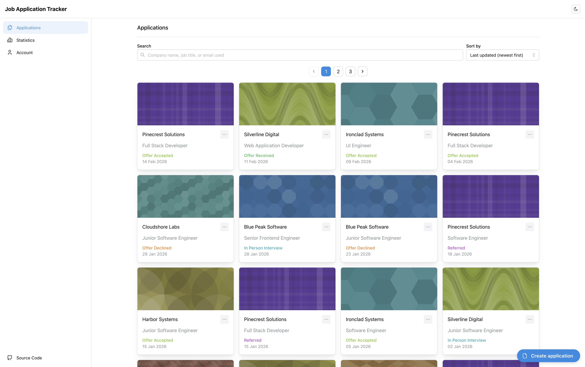
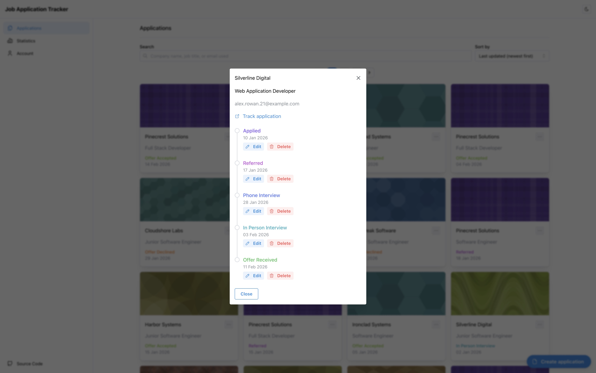
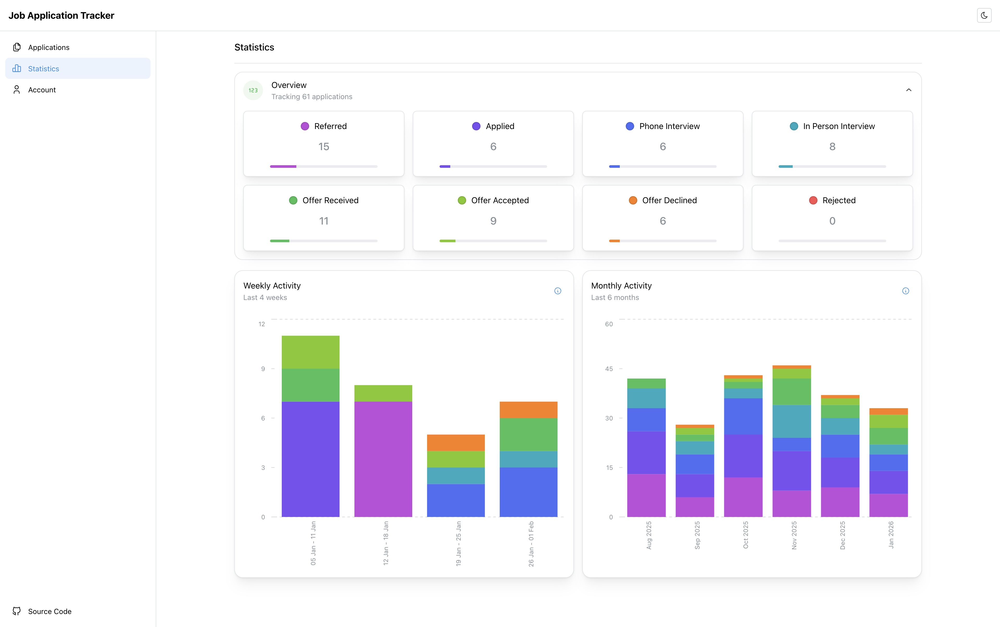
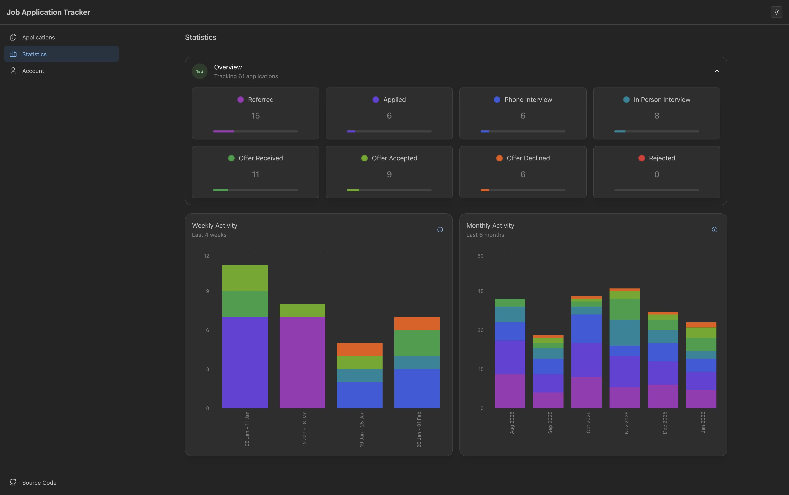

# Job Application Tracker

A comprehensive full-stack web application designed to help users track and manage their job applications efficiently.

## Features

- **Application Tracking**: Keep detailed records of all your job applications, including company name, position, status, and dates.
- **Status Management**: Track the lifecycle of each application.
- **Statistics and Insights**: Visualize your application progress with built-in analytics and charts.
- **Secure Authentication**: User registration and login system to keep your data private.
- **Responsive Design**: Modern and responsive user interface built with Mantine UI.
- **Dark Mode**: Fully supported dark theme for better visibility in low-light environments.

## Screenshots


_Manage all your applications in one place_


_View and edit details for each application_


_Visualize your job search progress_


_Sleek dark mode for comfortable viewing_


_Manage your account settings_

## Tech Stack

**Backend (API)**

- **Runtime**: Node.js
- **Framework**: Express.js
- **Database**: MongoDB with Mongoose
- **Language**: TypeScript
- **Authentication**: JWT (JSON Web Tokens)

**Frontend (Webapp)**

- **Framework**: React
- **Build Tool**: Vite
- **UI Library**: Mantine UI
- **Language**: TypeScript
- **Routing**: React Router

## Getting Started

Follow these steps to set up the project locally on your machine.

### Prerequisites

- [Node.js](https://nodejs.org/) (v16+ recommended)
- [MongoDB](https://www.mongodb.com/) (running locally or a cloud instance)

### 1. Backend Setup (API)

Navigate to the `api` directory:

```bash
cd api
```

Install dependencies:

```bash
npm install
```

Configure environment variables:

1. Create a `.env` file in the `api` root (copy from `.env.example`). You can do this by running:
   ```bash
   cp .env.example .env
   ```
2. Add your configuration:

   ```env
   # Authentication and Server
   JWT_SECRET=your_super_secret_key
   PORT=4000

   # Database
   MONGO_URI=mongodb://localhost:27017/job-tracker

   # Pagination
   PAGE_SIZE=24
   ```

Start the development server:

```bash
npm run dev
```

The API should now be running on `http://localhost:4000`.

### 2. Frontend Setup (Webapp)

Open a new terminal and navigate to the `webapp` directory:

```bash
cd webapp
```

Install dependencies:

```bash
npm install
```

Configure environment variables:

1. Create a `.env` file in the `webapp` root (copy from `.env.example`). You can do this by running:
   ```bash
   cp .env.example .env
   ```
2. Add your configuration:
   ```env
   VITE_PAGE_SIZE=24
   # Note: This must be the same as PAGE_SIZE in the api .env
   ```

Start the development server:

```bash
npm run dev
```

The application should now be accessible at `http://localhost:5173` (or the port shown in your terminal).

## How to Build

To build the project for production:

**API:**

```bash
cd api
npm run build
# To start the production server:
npm start
```

**Webapp:**

```bash
cd webapp
npm run build
# The build output will be in the `dist` directory.
```
